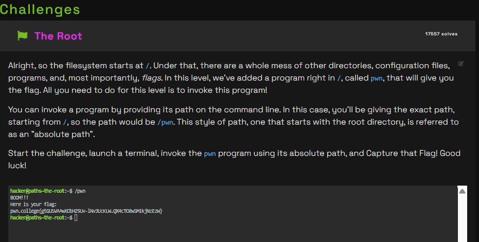

# Challenge Name
challenge is about how to access program in root directory

## My solve
**Flag:** `pwn.college{gtGUSVAAwKObH25Uv-lNv3UcKLW.QX4cTO0wSM1kjNzEzW}`

It was mentioned that we should invoke pwn  by using absolute path hence I use this '/'

I reasoned that an absolute path, which starts with /, is the only way to tell the shell the exact location of a file without ambiguity. I combined the root directory (/) with the program name (pwn) to form the correct command.
```d
hacker@paths~the-root:~$ /pwn
BOOM!!!
Here is your flag:
pwn.college{gtGUSVAAwKObH25Uv-lNv3UcKLW.QX4cTO0wSM1kjNzEzW}
```


## What I learned (optional)
how to invoke a program by writing it's absolute path and what is root directory is.

## Incorrect tangents (optional)
NA

## References (optional)
nothing apart from what was given in the website
