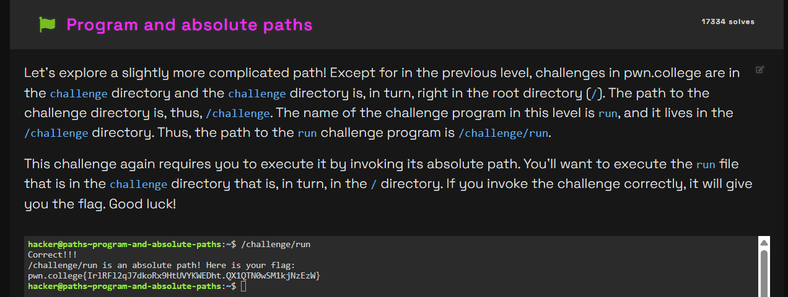

# Challenge Name
challenge is about how to write absolute path

## My solve
**Flag:** `pwn.college{IrlRFl2qJ7dkoRx9HtUVYKWEDht.QX1QTN0wSM1kjNzEzW}`

It was mentioned that we should invoke run file that is inside challenge directory hence I use this '/'

I knew that an absolute path is a fixed address that starts from the root of the entire file system. This means it doesn't matter what my current directory is; the path will work from anywhere. So, the most direct solution was to type the command exactly as it was given.

$ /challenge/run
```
hacker@paths~program-and-absolute-paths:~$ /challenge/run
Correct!!!
/challenge/run is an absolute path! Here is your flag:
pwn.college{IrlRFl2qJ7dkoRx9HtUVYKWEDht.QX1QTN0wSM1kjNzEzW}
```


## What I learned (optional)
how to invoke a file by writing it's absolute path.

## Incorrect tangents (optional)
NA

## References (optional)
nothing apart from what was given in the website
