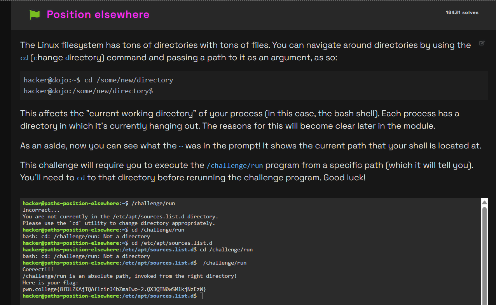

# Challenge Name
challenge is about how to change the position to else where

## My solve
**Flag:** `pwn.college{8fDLZKAjTQAflzirJ4bZmaEwo-2.QX3QTN0wSM1kjNzEzW}`

It was mentioned that we would be shown where to go and then we where supposed t change the path form there
```
hacker@paths~position-elsewhere:~$ /challenge/run
Incorrect...
You are not currently in the /etc/apt/sources.list.d directory.
Please use the `cd` utility to change directory appropriately.
hacker@paths~position-elsewhere:~$ cd /challenge/run
bash: cd: /challenge/run: Not a directory
hacker@paths~position-elsewhere:~$ cd /etc/apt/sources.list.d
hacker@paths~position-elsewhere:/etc/apt/sources.list.d$ cd /challenge/run
bash: cd: /challenge/run: Not a directory
hacker@paths~position-elsewhere:/etc/apt/sources.list.d$  /challenge/run
Correct!!!
/challenge/run is an absolute path, invoked from the right directory!
Here is your flag:
pwn.college{8fDLZKAjTQAflzirJ4bZmaEwo-2.QX3QTN0wSM1kjNzEzW}
```


## What I learned (optional)
how to change form one path to another

## Incorrect tangents (optional)
many like I directly put wrong path to know where I am supposed to move to.

## References (optional)
nothing apart from what was given in the website
