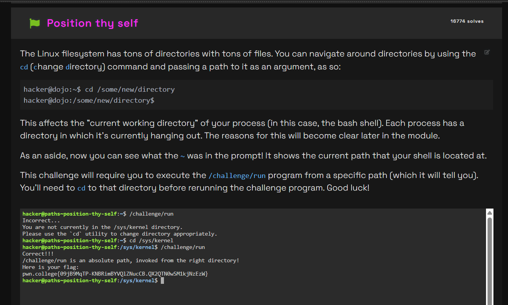
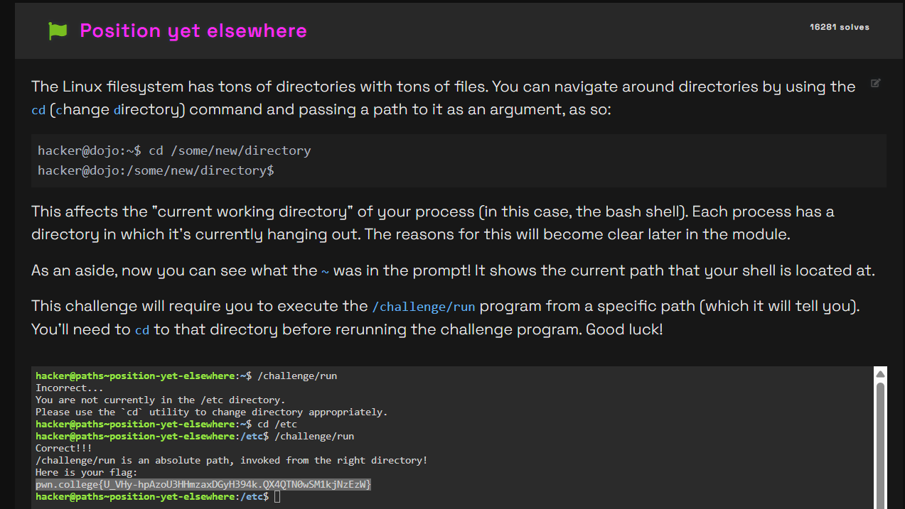

# Challenge Name
challenge is about how to change the position to else where and going to different path etc

## My solve
**Flag:** `git checkout -b feature/pondering-paths-challenge-3`
`pwn.college{8fDLZKAjTQAflzirJ4bZmaEwo-2.QX3QTN0wSM1kjNzEzW}`
`pwn.college{U_VHy-hpAzoU3HHmzaxDGyH394k.QX4QTN0wSM1kjNzEzW}`

It was mentioned to go the the given path using the things mentioned

My initial attempts to run the program failed with an error message telling me I wasn't in the correct directory. This was the key clue. My thought process was that I had to stop trying to run the program and first focus on navigating to the correct location.

Step 1: Identify the Target Directory
The error message explicitly stated the required location was /sys/kernel directory. I recognized this as an absolute path because it started with a /.

Step 2: Navigate with cd and Handle the Space
I knew the cd command was the tool for changing directories. I also noticed a space in kernel directory. My thought process was that the shell would misinterpret the space unless I handled it. I chose to wrap the entire absolute path in quotes to ensure the shell treated it as a single argument, which is a standard way to handle paths with spaces.

Step 3: Execute the Program
Once I was in the correct directory, I could then execute the program. The challenge description specified its location was /challenge/run, which is another absolute path
```
hacker@paths~position-thy-self:~$ /challenge/run
Incorrect...
You are not currently in the /sys/kernel directory.
Please use the `cd` utility to change directory appropriately.
hacker@paths~position-thy-self:~$ cd /sys/kernel
hacker@paths~position-thy-self:/sys/kernel$ /challenge/run
Correct!!!
/challenge/run is an absolute path, invoked from the right directory!
Here is your flag:
pwn.college{09jB9MqTP-KNBRimBYVQlZNucCB.QX2QTN0wSM1kjNzEzW}
```
It was mentioned that we would be shown where to go and then we where supposed t change the path form there
```
hacker@paths~position-elsewhere:~$ /challenge/run
Incorrect...
You are not currently in the /etc/apt/sources.list.d directory.
Please use the `cd` utility to change directory appropriately.
hacker@paths~position-elsewhere:~$ cd /challenge/run
bash: cd: /challenge/run: Not a directory
hacker@paths~position-elsewhere:~$ cd /etc/apt/sources.list.d
hacker@paths~position-elsewhere:/etc/apt/sources.list.d$ cd /challenge/run
bash: cd: /challenge/run: Not a directory
hacker@paths~position-elsewhere:/etc/apt/sources.list.d$  /challenge/run
Correct!!!
/challenge/run is an absolute path, invoked from the right directory!
Here is your flag:
pwn.college{8fDLZKAjTQAflzirJ4bZmaEwo-2.QX3QTN0wSM1kjNzEzW}
```
```
hacker@paths~position-yet-elsewhere:~$ /challenge/run
Incorrect...
You are not currently in the /etc directory.
Please use the `cd` utility to change directory appropriately.
hacker@paths~position-yet-elsewhere:~$ cd /etc
hacker@paths~position-yet-elsewhere:/etc$ /challenge/run
Correct!!!
/challenge/run is an absolute path, invoked from the right directory!
Here is your flag:
pwn.college{U_VHy-hpAzoU3HHmzaxDGyH394k.QX4QTN0wSM1kjNzEzW}
```





## What I learned (optional)
how to change form one path to another

## Incorrect tangents (optional)
many like I directly put wrong path to know where I am supposed to move to.

## References (optional)
nothing apart from what was given in the website
