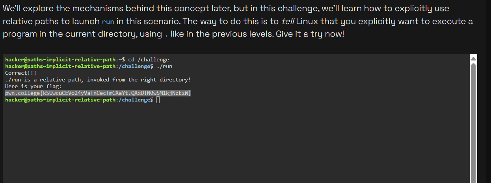

# Challenge Name
challenge is about how to write implicit relative path

## My solve
**Flag:** `pwn.college{kSUwcuCEVo24yVaTnCecTmGXaYt.QXxUTN0wSM1kjNzEzW}`


My thought process for this challenge was to simplify the problem. I knew the program I needed to run was inside the /challenge directory. Instead of trying to figure out a complex path from my starting location, I decided to first position myself correctly.

Step 1: The "Position Thyself" Logic
My first goal was to get into the /challenge directory. I knew the most reliable way to get to any known folder is to use its absolute path. The command cd /challenge would take me there directly, no matter where I started.

Step 2: The "Explicit Relative Path" Logic
Once I was inside the /challenge directory, the run program was right there with me. The most direct and secure way to execute a program in the current directory is to use the explicit relative path ./run.

Step 3: Execution
I combined these two steps to solve the challenge efficiently. First, I moved to the correct location, then I ran the program.


```
hacker@paths~implicit-relative-path:~$ cd /challenge
hacker@paths~implicit-relative-path:/challenge$ ./run
Correct!!!
./run is a relative path, invoked from the right directory!
Here is your flag:
pwn.college{kSUwcuCEVo24yVaTnCecTmGXaYt.QXxUTN0wSM1kjNzEzW}
```


## What I learned
This challenge taught me a very practical workflow: when faced with a complex pathing problem, it's often easiest to first use cd with an absolute path to get to the right location, and then execute the program with a simple relative path like ./.

## Incorrect tangents
NA

## References
nothing apart from what was given in the website
