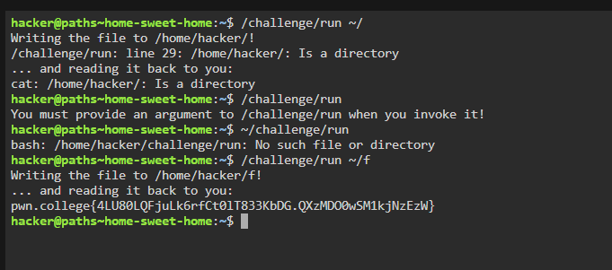

# Challenge Name
Home sweet home

## My solve
**Flag:** `pwn.college{4LU80LQFjuLk6rfCt0lT833KbDG.QXzMDO0wSM1kjNzEzW}`


My thought process was to break down and solve each of the three constraints one by one.

Step 1: Analyzing the Constraints

Absolute Path & Inside Home Directory: The first two rules pointed directly to a single solution: the ~ (tilde) shortcut. I knew the shell automatically expands ~ to the absolute path of the current user's home directory (e.g., /home/hacker).

Three Characters or Less: This was the main puzzle. ~ is only one character, leaving me with two more to work with.

File, not a Directory: My first attempt failed because the program needs a filename to write to, not just a directory. This meant I had to use a / to separate the directory from a filename.

Step 2: Crafting the Solution
Based on my analysis, I constructed the argument ~/f.

It uses the ~ shortcut.

It points to a file named f.

Critically, the entire string ~/f is exactly three characters long, meeting the final constraint.


```
hacker@paths~home-sweet-home:~$ /challenge/run ~/
Writing the file to /home/hacker/!
/challenge/run: line 29: /home/hacker/: Is a directory
... and reading it back to you:
cat: /home/hacker/: Is a directory
hacker@paths~home-sweet-home:~$ /challenge/run
You must provide an argument to /challenge/run when you invoke it!
hacker@paths~home-sweet-home:~$ ~/challenge/run
bash: /home/hacker/challenge/run: No such file or directory
hacker@paths~home-sweet-home:~$ /challenge/run ~/f
Writing the file to /home/hacker/f!
... and reading it back to you:
pwn.college{4LU80LQFjuLk6rfCt0lT833KbDG.QXzMDO0wSM1kjNzEzW}
hacker@paths~home-sweet-home:~$ 
```


## What I learned
This challenge was a fantastic lesson in the power and conciseness of shell shortcuts. I learned how shell expansion works with ~ and how to use it to satisfy multiple complex constraints (absolute path, home directory, and character limit) all at once.
## Incorrect tangents
NA

## References
nothing apart from what was given in the website
