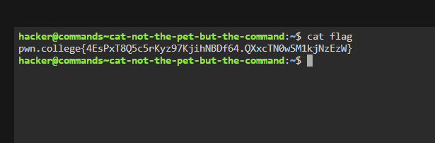

# Challenge Name
This was the first challenge in the "Comprehending Commands" module. The goal was to use the cat command to read the content of a file that was placed in my home directory.

## My solve
**Flag:** `pwn.college{4EsPxT8Q5c5rKyz97KjihNBDf64.QXxcTN0wSM1kjNzEzW}`

My thought process was to use the most direct command for reading files.

Step 1: Identifying the Goal
The prompt clearly stated that a file named flag existed in my current directory (~) and that I needed to read its contents.

Step 2: Choosing the Right Tool
I knew from the module name and the challenge title that the cat command was the tool for this job. cat is the standard command for concatenating and displaying file content.

Step 3: Execution
Since the flag file was in my current working directory, I didn't need a complex path. I just needed to give cat the name of the file as an argument.
```
hacker@commands~cat-not-the-pet-but-the-command:~$ cat flag
pwn.college{4EsPxT8Q5c5rKyz97KjihNBDf64.QXxcTN0wSM1kjNzEzW}
```


## What I learned (optional)
This challenge was a straightforward introduction to the cat command. I learned its basic syntax (cat [filename]) and confirmed that it's the primary tool for quickly viewing the contents of a file directly in the terminal.

## Incorrect tangents (optional)
NA

## References (optional)
nothing apart from what was given in the website
