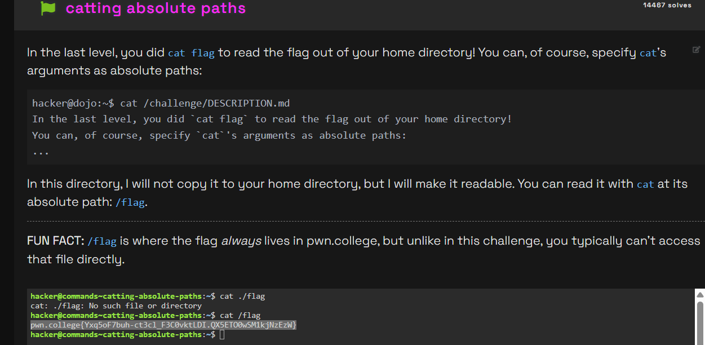

# Challenge Name
This challenge was about understanding the difference between relative and absolute paths, specifically when using the cat command to read a file that isn't in the current directory.

## My solve
**Flag:** `pwn.college{Yxq5oF7buh-ct3cl_F3C0vktLDI.QX5ETO0wSM1kjNzEzW}`

My thought process was to first try the most direct approach, and then use the information from the prompt to correct my mistake.

Step 1: The Initial (Incorrect) Attempt
My first instinct was to treat the flag like it was in my current folder. I tried running cat ./flag, but this failed because ./ refers to the current directory, and the challenge clearly stated the file wasn't there.

Step 2: Correcting with the Absolute Path
The prompt explicitly mentioned that the flag was at the absolute path /flag. I realized this meant I had to start my path from the very top of the filesystem (the root, /). This path works no matter where my current directory is.

Step 3: Execution
I then used the correct absolute path with the cat command, which successfully read the file and gave me the flag.

```
hacker@commands~catting-absolute-paths:~$ cat ./flag
cat: ./flag: No such file or directory
hacker@commands~catting-absolute-paths:~$ cat /flag
pwn.college{Yxq5oF7buh-ct3cl_F3C0vktLDI.QX5ETO0wSM1kjNzEzW}
hacker@commands~catting-absolute-paths:~$  
```


## What I learned (optional)
This was a great lesson in the importance of absolute vs. relative paths. I learned that cat ./file only works if the file is in my current folder, while cat /file will work from anywhere on the system because it starts from the root directory.

## Incorrect tangents (optional)
My initial attempt of cat ./flag was my incorrect tangent. It failed because I was thinking relatively (from my current spot) instead of absolutely (from the root of the whole system).

## References (optional)
nothing apart from what was given in the website
